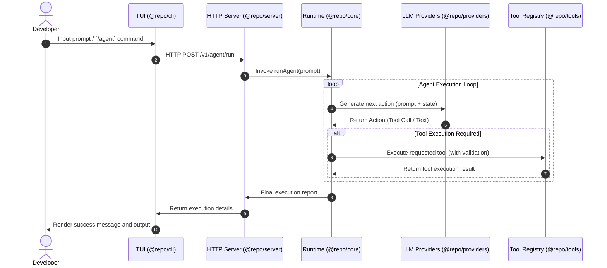

# Ra9

An autonomous agent runtime and terminal user interface (TUI) for local software development workflows.

[](https://bun.sh)
[](https://turbo.build)
[](https://www.typescriptlang.org)
[](https://github.com)
[](LICENSE)

Ra9 is a terminal-native workspace that integrates persistent shell sessions, context-aware memory, step-by-step planning, tool orchestration, and sandboxed execution into a single developer interface. Unlike conversational chat interfaces, Ra9 runs as an autonomous system that operates directly inside your workspace to perform file edits, run terminal commands, and resolve coding objectives.

---

## Workspace Architecture

Ra9 is structured as a monorepo managed with Bun workspaces and Turborepo.

```
Ra9/
├── apps/
│   ├── cli/          # Interactive terminal interface (@repo/cli)
│   └── server/       # HTTP API gateway server (@repo/server)
├── packages/
│   ├── core/         # Core agent runtime loop (@repo/core)
│   ├── protocol/     # Standard message formats (@repo/protocol)
│   ├── providers/    # Model and integration adapters (@repo/providers)
│   ├── tools/        # Extensible tool registry (@repo/tools)
│   └── tsconfig/     # Shared compiler configuration (@repo/tsconfig)
```

### Module Responsibilities

* **`@repo/cli`**: The user interface layer. Built using React and OpenTUI, it renders interactive menus, a command console, scrollable popovers, and toast notifications.
* **`@repo/server`**: An Express 5 application that exposes the agent capability via a REST API on port `3000`.
* **`@repo/core`**: The main execution engine. It coordinates agent state, receives system prompts, and drives the reasoning loop.
* **`@repo/protocol`**: Type definitions, message schemas, and structure standards for agent-host communication.
* **`@repo/providers`**: API clients and abstractions for LLM providers.
* **`@repo/tools`**: The registration and execution system for terminal commands, file utilities, and search integrations.
* **`@repo/tsconfig`**: Shared TypeScript configuration enabling strict compilation checks, targeting ES2022.

---

## Key Features

### Terminal User Interface (TUI)
Built with `@opentui/core` and `@opentui/react`, the TUI is designed for full keyboard navigation and efficient terminal layouts:
* **Interactive Command Menu**: Press `/` to trigger a scrollable menu listing all available slash commands.
* **Key Interceptions**: Navigate choices with arrow keys, use `Tab` to autocomplete options, `Enter` to confirm, and `Escape` to dismiss inputs.
* **Responsive Rendering**: Layout heights, panel widths, and visual components adjust automatically to fit your terminal dimensions.
* **Dynamic Color Themes**: Supports multiple display themes designed for low-light terminal interfaces, including:
  * *Eldritch Void* (Neon green and dark violet)
  * *Copper Patina* (Polished copper and verdigris green)
  * *Abyssal Trench* (Bioluminescent pink and deep sea navy)
  * *Neon Syndicate* (Yellow and synth magenta)
  * *Matcha Noir* (Matcha green and dark roasted olive)
* **Real-time Status Bar**: Tracks active models and system resource indicators.
* **Actionable Toasts**: Displays operation success or error notifications within the terminal bounds.

### Extensible Tool System
Tools are structured using [Zod](https://zod.dev) schemas for input validation, ensuring reliable runtime execution:

```typescript
import { z } from "zod";

export interface ToolDefinition<TInput = any, TOutput = any> {
  name: string;
  description: string;
  schema: z.ZodSchema<TInput>;
  execute: (input: TInput) => Promise<TOutput>;
}
```

---

## Getting Started

### Prerequisites
* **Bun** 1.1 or higher
* **Node.js** 20 or higher

### Installation

Clone the repository and install dependencies:

```bash
bun install
```

### Local Development

Run the entire environment or individual services using Turborepo filters:

```bash
# Run all workspace packages in development mode
bun dev

# Start the interactive CLI client only
bun dev:cli

# Start the API gateway server only
bun --filter @repo/server dev
```

### Project Tasks

```bash
# Compile and build all modules
bun build

# Clean cached build files and logs
bun clean
```

---

## CLI Command Reference

Execute commands in the TUI prompt:

| Command | Action Description |
|:---|:---|
| `/agent` | Launch an agent with a target development goal |
| `/new` | Initialize a new session thread |
| `/sessions` | Display active session identifiers |
| `/models` | Query and list available models |
| `/theme` | Open interactive selection of active terminal color theme |
| `/usage` | View detailed token and API call statistics |
| `/help` | Print instructions for active terminal functions |
| `/logout` | Terminate session authorization |
| `/exit` | Gracefully shut down current terminal interface |

---

## System Design and Flow



---

## License

This project is licensed under the MIT License. See [LICENSE](LICENSE) for details.

